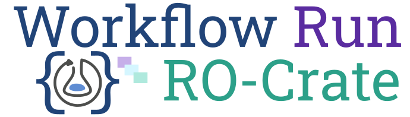

Workflow Run RO-Crate is a working group for defining [RO-Crate](https://w3id.org/ro/crate) profiles for capturing the provenance of an execution of a computational workflow.

## WRROC Profiles

The [Workflow Run RO-Crate (WRROC) profile collection](profiles) is the main outcome of the group's activities.

Workflow Run RO-Crate is an extension of [RO-Crate](https://w3id.org/ro/crate) (Research Object Crate) and Schema.org to capture the provenance of the execution of computational workflows at different levels of granularity and bundle together all their associated products (inputs, outputs, code, etc.).

## Citation and publications

Simone Leo, Michael R. Crusoe, Laura Rodríguez-Navas, Raül Sirvent, Alexander Kanitz, Paul De Geest, Rudolf Wittner, Luca Pireddu, Daniel Garijo, José M. Fernández, Iacopo Colonnelli, Matej Gallo, Tazro Ohta, Hirotaka Suetake, Salvador Capella-Gutierrez, Renske de Wit, Bruno P. Kinoshita, Stian Soiland-Reyes (2024)
Recording provenance of workflow runs with RO-Crate.
PLoS ONE 19(9): e0309210.
<https://doi.org/10.1371/journal.pone.0309210>

See [Outreach](outreach) for other citations, publications and presentations on Workflow Run RO-Crate

## Community

The Workflow Run RO-Crate working group is part of the [RO-Crate community](https://www.researchobject.org/ro-crate/community.html).

We coordinate using the channel [#ro-crate on seek4science.slack.com](https://seek4science.slack.com/archives/C01LQQAAAS1) ([join](https://join.slack.com/t/seek4science/shared_invite/zt-csqh94qb-kf~kFbZxuHl1Hpxhbc8avw)) and the [RO-Crate mailing list](https://lists.elixir-europe.org/mailman/listinfo/ro-crate_elixir-europe.org). Material from or related to the group's activity is available from the [GitHub repository](https://github.com/ResearchObject/workflow-run-crate).

Currently we have [bi-weekly meetings](https://docs.google.com/document/d/1shvkoowuCVUy8E2ujnVPclaoQO4jGKmZpafjOR0OfBw/edit) you are welcome to attend.

Post [here](https://github.com/ResearchObject/workflow-run-crate/issues/1) to join the working group.

**Members**:
- Simone Leo <https://orcid.org/0000-0001-8271-5429>
- Laura Rodríguez-Navas <https://orcid.org/0000-0003-4929-1219>
- Stian Soiland-Reyes <https://orcid.org/0000-0001-9842-9718>
- Paul Brack <https://orcid.org/0000-0002-5432-2748>
- José María Fernández <https://orcid.org/0000-0002-4806-5140>
- Alan R Williams <https://orcid.org/0000-0003-3156-2105>
- Ignacio Eguinoa <https://orcid.org/0000-0002-6190-122X>
- Daniel Garijo <https://orcid.org/0000-0003-0454-7145>
- Paul De Geest <https://orcid.org/0000-0002-8940-4946>
- Raül Sirvent <https://orcid.org/0000-0003-0606-2512>
- Alexander Kanitz <https://orcid.org/0000-0002-3468-0652>
- Michael R Crusoe <https://orcid.org/0000-0002-2961-9670>
- LJ Garcia Castro <https://orcid.org/0000-0003-3986-0510>
- Rudolf Wittner <https://orcid.org/0000-0002-0003-2024>
- Wolfgang Maier <https://orcid.org/0000-0002-9464-6640>
- Sebastiaan Huber <https://orcid.org/0000-0001-5845-8880>
- Kevin Jablonka <https://orcid.org/0000-0003-4894-4660>
- Haris Zafeiropoulos <https://orcid.org/0000-0002-4405-6802>
- Iacopo Colonnelli <https://orcid.org/0000-0001-9290-2017>
- Jake Emerson <https://orcid.org/0000-0003-0617-9219>
- Abigail Miller <https://orcid.org/0000-0001-9228-2882>
- Stelios Ninidakis <https://orcid.org/0000-0003-3898-9451>
- Tazro Ohta <https://orcid.org/0000-0003-3777-5945>
- Hirotaka Suetake <https://orcid.org/0000-0003-2765-0049>
- Johannes Köster <https://orcid.org/0000-0001-9818-9320>
- Luiz Gadelha <https://orcid.org/0000-0002-8122-9522>
- Mahnoor Zulfiqar <https://orcid.org/0000-0002-8330-4071>
- Romain David <https://orcid.org/0000-0003-4073-7456>
- Maciek Bąk <https://orcid.org/0000-0003-1361-7301>
- Petr Holub <https://orcid.org/0000-0002-5358-616X>
- Milan Markovic <https://orcid.org/0000-0002-5477-287X>
- Bruno P. Kinoshita <https://orcid.org/0000-0001-8250-4074>
- Renske de Wit <https://orcid.org/0000-0003-0902-0086>
- Jasper Koehorst <https://orcid.org/0000-0001-8172-8981>
- Samuel Lampa <https://orcid.org/0000-0001-6740-9212>
- Samuel Grayson <https://orcid.org/0000-0001-5411-356X>
- Jörg F. Unger <https://orcid.org/0000-0003-0035-0951>
- Felix Bartusch <https://orcid.org/0000-0003-0711-5196>
- Daniel Wheeler <https://orcid.org/0000-0002-2653-7418>
- Luca Pireddu <https://orcid.org/0000-0002-4663-5613>
- Jilong Liu <https://orcid.org/0009-0006-6236-1073>
- Ernest Prabhakar <https://orcid.org/0009-0003-3768-3781>
- Saleha Muzammil <https://orcid.org/0009-0009-6097-592X>
- ... [you](https://github.com/ResearchObject/workflow-run-crate/issues/1)?

## Implementations & examples

Several workflow engines have implemented the [WRROC profiles](https://www.researchobject.org/workflow-run-crate/profiles/) or are planning to do so:

**Implementation**  | **Profile** | **Version URL/DOI**    | **Example**             |
------------| ----------- | ---------------------- | ----------------------- |
[runcrate](http://www.researchobject.org/runcrate/)   | Provenance  | [runcrate 0.5.0](https://github.com/ResearchObject/runcrate/releases/tag/0.5.0) or later  |  [10.5281/zenodo.7774351](https://doi.org/10.5281/zenodo.7774351)  |
[Galaxy](https://galaxyproject.org/)      | Workflow    | [Galaxy 23.1.1](https://github.com/galaxyproject/galaxy/releases/tag/v23.1.1) or later   |  [10.5281/zenodo.7785861](https://doi.org/10.5281/zenodo.7785861)  |
[COMPSs](https://www.bsc.es/research-and-development/software-and-apps/software-list/comp-superscalar)     | Workflow    | [compss 3.2 or later](https://github.com/bsc-wdc/compss/releases/tag/v3.2)    |  [10.5281/zenodo.7788030](https://doi.org/10.5281/zenodo.7788030)      |
[StreamFlow](https://streamflow.di.unito.it/)  | Provenance  | [Streamflow 0.2.0.dev10](https://github.com/alpha-unito/streamflow/releases/tag/0.2.0.dev10) |  [10.5281/zenodo.7911906](https://doi.org/10.5281/zenodo.7911906) |
[WfExS](https://wfexs-backend.readthedocs.io/)       | Workflow    | [WfExS 0.10.1](https://github.com/inab/WfExS-backend/releases/tag/0.10.1) or later  |  [10.5281/zenodo.10091550](https://doi.org/10.5281/zenodo.10091550) |
[Sapporo](https://github.com/sapporo-wes/sapporo)     | Workflow    | [sapporo-service 1.5.1](https://github.com/sapporo-wes/sapporo-service/releases/tag/1.5.1)  or later  |  [10.5281/zenodo.10134581](https://doi.org/10.5281/zenodo.10134581)  |
[Autosubmit](https://autosubmit.readthedocs.io/)  | Workflow    | [Autosubmit v4.0.100](https://pypi.org/project/autosubmit/4.0.100/) or later    |  [10.5281/zenodo.8144612](https://doi.org/10.5281/zenodo.8144612)   |
[Nextflow](https://nextflow.io/)  | Provenance    | [nf-prov](https://github.com/nextflow-io/nf-prov/blob/main/docs/WRROC.md) 1.4.0 or later  |  [example](https://github.com/nextflow-io/nf-prov/files/13070992/ro-crate-metadata.json)   |

The Process Crate profile can also be implemented outside workflow systems, see for example [BY-COVID WP5 T5.2 Baseline Use Case](https://w3id.org/ro/doi/10.5281/zenodo.6913045) and [combination with Common Provenance Model](https://doi.org/10.5281/zenodo.7676923). Editors like [Crate-O](https://language-research-technology.github.io/crate-o/) can be used for making such crates by hand.

The Workflow Crate and Provenance Crate profiles extends the [Workflow RO-Crate](https://w3id.org/workflowhub/workflow-ro-crate/) profile, which is [supported by WorkflowHub](https://about.workflowhub.eu/developer/ro-crate-api/#submitting-workflows) registry.

The Workflow Crate profiles have themselves been extended by the [Five Safes RO-Crate](https://w3id.org/5s-crate/), used by the projects [TRE-FX](https://trefx.uk/) and [EOSC-ENTRUST](https://esciencelab.org.uk/projects/eosc-entrust/).

In addition, some computational workflow approaches have RO-Crate support which predate the WRROC profiles: [LivePublication](https://livepublication.github.io/LP_Pub_LID/) ([example](https://livepublication.github.io/LP_Pub_OrchestrationCrate/), [paper](https://doi.org/10.1109/e-Science58273.2023.10254857)), [RECUP](https://sites.google.com/view/recup-reproducibility/) ([paper](https://doi.org/10.1109/e-science58273.2023.10254808)), [FAIRSCAPE](https://fairscape.github.io/) ([paper](https://doi.org/10.1007/978-3-030-80960-7_3))

## Training and outreach

- [Workflow Run RO-Crate Introduction](https://training.galaxyproject.org/training-material/topics/fair/tutorials/ro-crate-workflow-run-ro-crate/tutorial.html)
- [RO-Crate tutorial](https://www.researchobject.org/ro-crate/tutorials.html)
- [Slides](https://slides.com/soilandreyes/2023-11-23-ro-crate-erga) -- _RO-Crate Use cases in biodiversity_
- [Poster](https://doi.org/10.7490/f1000research.1119457.1) -- _WfExS-backend in the WRROC world?_
- [Poster](https://doi.org/10.5281/zenodo.8004793) -- _Making workflow provenance FAIR across workflow systems with Workflow Run RO-Crate_

## Other resources

- [Requirements for the Workflow Run RO-Crate profiles](requirements)
- [Workflow RO-Crate profile](https://about.workflowhub.eu/Workflow-RO-Crate/) -- for describing workflows as reusable objects. (extended by [workflow run profile](profiles/workflow_run_crate))
- [Profile for recording workflow runs](https://www.researchobject.org/2021-packaging-research-artefacts-with-ro-crate/manuscript.html#profile-for-recording-workflow-runs) (conceptual ideas from RO-Crate paper)
- [Example of CreateAction and Docker Image](https://www.researchobject.org/2021-packaging-research-artefacts-with-ro-crate/ro-crate-preview.html#https%3A//github.com/stain/ro-crate-paper/actions/runs/1671704144) (tool invocation)

### RO-Crate links

- [RO-Crate homepage](https://w3id.org/ro/crate)
- [RO-Crate specification 1.1](https://www.researchobject.org/ro-crate/1.1/)
- [RO-Crate profiles](https://www.researchobject.org/ro-crate/1.2-DRAFT/profiles) (from 1.2-DRAFT -- feedback welcome)
- [Workflow Crate](https://w3id.org/workflowhub/workflow-ro-crate/)  (profile for a workflow _definition_)
- [Workflow Testing Crate](https://lifemonitor.eu/workflow_testing_ro_crate) (profile for defining workflow tests)
- [Adding a ComputationalWorkflow in RO-Crate](https://www.researchobject.org/ro-crate/1.1/workflows.html)
- [ComputationalWorkflow profile in BioSchemas](https://bioschemas.org/profiles/ComputationalWorkflow/)
- [ComputationalTool profile in BioSchemas](https://bioschemas.org/profiles/ComputationalTool/1.0-RELEASE)
- [Provenance of software run in RO-Crate](https://www.researchobject.org/ro-crate/1.1/provenance.html)
- [BioComputeObject in RO-Crate](https://biocompute-objects.github.io/bco-ro-crate/tutorial/starting.html#skeleton-ro-crate)

### Related Work

- [Packaging research artefacts with RO-Crate](https://www.researchobject.org/2021-packaging-research-artefacts-with-ro-crate/manuscript.html) (RO-rate article)
- [Sharing interoperable workflow provenance: A review of best practices and their practical application in CWLProv ](https://doi.org/10.1093/gigascience/giz095) (RO-Bundle+PROV for CWL, -- see also [examples](https://w3id.org/cwl/prov/0.6.0))
- [Towards a Common Standard for Data and Specimen Provenance in Life Sciences](https://doi.org/10.5281/zenodo.5093125) (article on ISO 23494 Common Provenance Model)
- [ISO 23494: Biotechnology - Provenance Information Model for Biological Specimen and Data](https://doi.org/10.1007/978-3-030-80960-7_16) (poster article on ISO 23494)
- [EOSC-Life Common Provenance Model](https://doi.org/10.5281/zenodo.4705074) (deliverable showing ISO 23494 model)
- [P-Plan ontology](https://www.opmw.org/model/p-plan/), [OPMW ontology](https://www.opmw.org/model/OPMW/) and [OPMW-PROV](https://www.opmw.org/interoperability.html)
- [ProvONE+: A Provenance Model for Scientific Workflows](https://doi.org/10.1007/978-3-030-62008-0_30) (not Open Access) [[PROV-One ontology](https://purl.dataone.org/provone-v1-dev)]

## License for specifications

© 2021--2026 The University of Manchester, UK
© 2022--2026 Centro di Ricerca, Sviluppo e Studi Superiori in Sardegna (CRS4), IT
© 2022--2026 Workflow Run Crate task force contributors

Licensed under the Apache License, Version 2.0 (the “License”); you may not use this file except in compliance with the License. You may obtain a copy of the License at

<http://www.apache.org/licenses/LICENSE-2.0>

Unless required by applicable law or agreed to in writing, software distributed under the License is distributed on an “AS IS” BASIS, WITHOUT WARRANTIES OR CONDITIONS OF ANY KIND, either express or implied. See the License for the specific language governing permissions and limitations under the License.

### License for examples

Profile Crates and JSON-LD examples within this specification are distributed
under [CC0 1.0 Universal (CC0 1.0) Public Domain Dedication](https://creativecommons.org/publicdomain/zero/1.0/).
