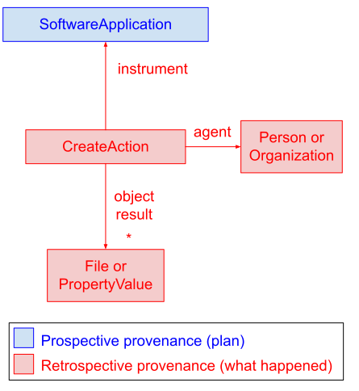
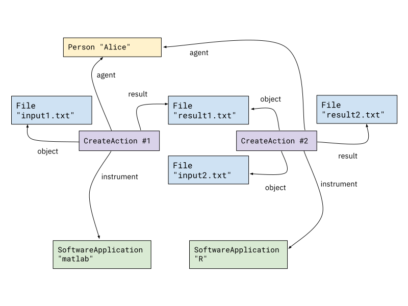

# Process Run Crate

* Version: 0.4-DRAFT
* Permalink: <https://w3id.org/ro/wfrun/process/0.4-DRAFT>
* Authors: Workflow Run RO-Crate working group

This profile uses terminology from the [RO-Crate 1.1 specification](https://w3id.org/ro/crate/1.1), and [extends it](https://www.researchobject.org/ro-crate/1.1/appendix/jsonld.html#extending-ro-crate) with additional terms from the [workflow-run](https://github.com/ResearchObject/ro-terms/tree/master/workflow-run) ro-terms namespace.


## Overview

This profile is used to describe the execution of an _implicit_ workflow, indicating that one or more computational tools have been executed, typically generating some result files that are represented as [data entities](https://www.researchobject.org/ro-crate/1.1/data-entities.html) in the RO-Crate.

By "implicit workflow" we mean that the composition of these tools may have been done by hand (a user executes one tool following another) or by some script that has not yet been included as part of the crate (for instance because it is an embedded part of a larger application).

This profile requires the indication of [Software used to create files](https://www.researchobject.org/ro-crate/1.1/provenance.html#software-used-to-create-files), namely a [SoftwareApplication](http://schema.org/SoftwareApplication) (the tool) and a [CreateAction](http://schema.org/CreateAction) (the execution of said tool).

The following diagram shows the relationships between provenance-related entities. Note the distinction between *prospective* provenance (plans for activities, e.g., an application) and *retrospective* provenance (what actually happened, e.g. the execution of an application).




## Example Metadata File (`ro-crate-metadata.json`)

```json
{ "@context": "https://w3id.org/ro/crate/1.1/context", 
  "@graph": [
    {
        "@id": "ro-crate-metadata.json",
        "@type": "CreativeWork",
        "conformsTo": {"@id": "https://w3id.org/ro/crate/1.1"},
        "about": {"@id": "./"}
    },
    {
        "@id": "./",
        "@type": "Dataset",
        "conformsTo": {"@id": "https://w3id.org/ro/wfrun/process/0.1"},
        "hasPart": [
            {"@id": "pics/2017-06-11%2012.56.14.jpg"},
            {"@id": "pics/sepia_fence.jpg"}
        ],
        "mentions": {"@id": "#SepiaConversion_1"},
        "name": "My Pictures"
    },
    {   "@id": "https://w3id.org/ro/wfrun/process/0.1",
        "@type": "CreativeWork",
        "name": "Process Run Crate",
        "version": "0.1"
    },
    {
        "@id": "https://www.imagemagick.org/",
        "@type": "SoftwareApplication",
        "url": "https://www.imagemagick.org/",
        "name": "ImageMagick",
        "softwareVersion": "6.9.7-4"
    },
    {
        "@id": "#SepiaConversion_1",
        "@type": "CreateAction",
        "name": "Convert dog image to sepia",
        "description": "convert -sepia-tone 80% test_data/sample/pics/2017-06-11\\ 12.56.14.jpg test_data/sample/pics/sepia_fence.jpg",
        "endTime": "2018-09-19T17:01:07+10:00",
        "instrument": {"@id": "https://www.imagemagick.org/"},
        "object": {"@id": "pics/2017-06-11%2012.56.14.jpg"},
        "result": {"@id": "pics/sepia_fence.jpg"},
        "agent": {"@id": "https://orcid.org/0000-0001-9842-9718"}
    },
    {
        "@id": "pics/2017-06-11%2012.56.14.jpg",
        "@type": "File",
        "description": "Original image",
        "encodingFormat": "image/jpeg",
        "name": "2017-06-11 12.56.14.jpg (input)"
    },
    {
        "@id": "pics/sepia_fence.jpg",
        "@type": "File",
        "description": "The converted picture, now sepia-colored",
        "encodingFormat": "image/jpeg",
        "name": "sepia_fence (output)"
    },
    {
        "@id": "https://orcid.org/0000-0001-9842-9718",
        "@type": "Person",
        "name": "Stian Soiland-Reyes"
    }
]
}
```

Note that the command line shown in the action's `description` is not directly re-executable, as file paths are not required to match the RO-Crate locations. For a more structural and reproducible description of tool executions, see [Workflow Run Crate](workflow_run_crate).


## Requirements

<table>

  <tr>
   <td><strong>Property</strong></td>
   <td><strong>Required?</strong></td>
   <td><strong>Description</strong></td>
  </tr>

  <tr>
   <th colspan="3"><strong>Dataset</strong> (the <a href="https://www.researchobject.org/ro-crate/1.1/root-data-entity.html">root data entity</a>, e.g. <code>"@id": "./"</code>)</th>
  </tr>
  <tr>
   <td>conformsTo</td>
   <td>MUST</td>
   <td>MUST reference a <code>CreativeWork</code> entity with an <code>@id</code> URI that is consistent with the versioned <em>Permalink</em> of this document, e.g. <code>{"@id": "https://w3id.org/ro/wfrun/process/0.1"}</code></td>
  </tr>

  <tr>
   <th colspan="3"><strong>SoftwareApplication</strong></th>
  </tr>

  <tr>
   <td>@type</td>
   <td>MUST</td>
   <td>SHOULD include <a href="http://schema.org/SoftwareApplication">SoftwareApplication</a>, <a href="http://schema.org/SoftwareSourceCode">SoftwareSourceCode</a> or <a href="https://bioschemas.org/ComputationalWorkflow">ComputationalWorkflow</a></td>
  </tr>

  <tr>
   <td>@id</td>
   <td>MUST</td>
   <td>SHOULD be an absolute URI, but MAY be a relative URI to a data entity in the crate (e.g. <code>"bin/simulation4"</code>) or a local identifier for tools that are not otherwise described on the web (e.g. <code>"#statistical-analysis"</code>)</td>
  </tr>

  <tr>
   <td>name</td>
   <td>SHOULD</td>
   <td>A human readable name for the tool <em>in general</em> (not just how it was used here)</td>
  </tr>

  <tr>
   <td>url</td>
   <td>SHOULD</td>
   <td>Homepage, documentation or source for the tool</td>
  </tr>

  <tr>
   <td>version</td>
   <td>SHOULD</td>
   <td>The version string for the software application. In the case of a <code>SoftwareApplication</code>, this MAY be provided via the more specific <a href="http://schema.org/softwareVersion">softwareVersion</a>. <code>SoftwareApplication</code> entities SHOULD NOT specify both <code>version</code> and <code>softwareVersion</code>: in this case, consumers SHOULD prioritize <code>softwareVersion</code>. In order to facilitate comparison attempts by consumers, it is RECOMMENDED to specify a machine-readable version string if available (see for instance Python's <a href="https://peps.python.org/pep-0440/">PEP 440</a>).</td>
  </tr>

  <tr>
   <th colspan="3"><strong>CreateAction</strong></th>
  </tr>

  <tr>
   <td>@type</td>
   <td>MUST</td>
   <td>SHOULD be <a href="http://schema.org/CreateAction">CreateAction</a> to indicate that this tool created the <code>result</code> data entities. MAY be <a href="http://schema.org/ActivateAction">ActivateAction</a> if the provenance does not include any <code>result</code>. MAY be <a href="http://schema.org/UpdateAction">UpdateAction</a> if the tool modified an existing data entity or database in-place.</td>
  </tr>

  <tr>
   <td>@id</td>
   <td>MUST</td>
   <td>A unique identifier for the execution, e.g. <code>"urn:uuid:50ec5c76-1f7a-4130-8ef6-846756b228c1"</code>, <code>"#f99a8e6c"</code>. MAY be an absolute URI, e.g. <a href="http://example.com/runs/846756b228c1">http://example.com/runs/846756b228c1</a>. The use of randomly generated <a href="https://datatracker.ietf.org/doc/html/rfc4122">UUIDs</a> (type 4) is RECOMMENDED. SHOULD be listed under <a href="http://schema.org/mentions">mentions</a> of the <a href="https://www.researchobject.org/ro-crate/1.1/root-data-entity.html">root data entity</a>.</td>
  </tr>

  <tr>
   <td>name</td>
   <td>SHOULD</td>
   <td>Short human-readable description of the execution.</td>
  </tr>

  <tr>
   <td>description</td>
   <td>SHOULD</td>
   <td>Details of the execution, for instance command line arguments or settings. This field is for information only, no particular structure is to be assumed.</td>
  </tr>

  <tr>
   <td>endTime</td>
   <td>SHOULD</td>
   <td>The time the process ended, i.e. when the last of the entities in <code>result</code> has been created. SHOULD be a <a href="http://schema.org/DateTime">DateTime</a> in ISO 8601 format.</td>
  </tr>

  <tr>
   <td>startTime</td>
   <td>MAY</td>
   <td>The time the process started, i.e. the earliest time the process may have accessed an entity in <code>object</code>. SHOULD be a <a href="http://schema.org/DateTime">DateTime</a> in ISO 8601 format.</td>
  </tr>

  <tr>
   <td>instrument</td>
   <td>MUST</td>
   <td>Identifier of the executed tool.</td>
  </tr>

  <tr>
   <td>agent</td>
   <td>SHOULD</td>
   <td>Identifier of a <a href="https://www.researchobject.org/ro-crate/1.1/contextual-entities.html#people">Person</a> or <a href="https://www.researchobject.org/ro-crate/1.1/contextual-entities.html#organizations-as-values">Organization</a> contextual entity that started/executed this tool.</td>
  </tr>

  <tr>
   <td>object</td>
   <td>MAY</td>
   <td>The identifier of one or more entities of the RO-Crate that were consumed by this action, e.g. input files or reference datasets.</td>
  </tr>

  <tr>
   <td>result</td>
   <td>SHOULD</td>
   <td>The identifier of one or more entities that were created or modified by this action, e.g. output files.</td>
  </tr>

  <tr>
   <td>actionStatus</td>
   <td>MAY</td>
   <td>SHOULD be <a href="https://schema.org/CompletedActionStatus">CompletedActionStatus</a> if the process completed successfully or <a href="https://schema.org/FailedActionStatus">FailedActionStatus</a> if it failed to complete. In the latter case, consumers should be prepared for the absence of any dependent actions in the metadata. If this attribute is not specified, consumers should assume that the process completed successfully.</td>
  </tr>

  <tr>
   <td>error</td>
   <td>MAY</td>
   <td>Additional information on the cause of the failure, such as an error message from the application, if available. SHOULD NOT be specified unless <code>actionStatus</code> is set to <code>FailedActionStatus</code>.</td>
  </tr>

</table>

Entities referenced by an action's [object](http://schema.org/object) or [result](http://schema.org/result) SHOULD be of type `File` (an RO-Crate alias for [MediaObject](http://schema.org/MediaObject)) for files, [Dataset](http://schema.org/Dataset) for directories and [Collection](http://schema.org/Collection) for [multi-file datasets](#representing-multi-file-objects), but MAY be a [CreativeWork](http://schema.org/CreativeWork) for other types of data (e.g. an online database); they MAY be of type [PropertyValue](http://schema.org/PropertyValue) to capture numbers/strings that are not stored as files.

Data entities involved in an application's input and output SHOULD have an `@id` that reflects the original file or directory name as processed by the application, but MAY be renamed to avoid clashes with other entities in the crate. In this case, they SHOULD refer to the original name via [alternateName](http://schema.org/alternateName). This is particularly important to support reproducibility in cases where an application expects to find input in specific locations and with specific names (see the MIRAX example in [Representing multi-file objects](#representing-multi-file-objects)).


## Multiple processes

A process crate can be used to indicate one single execution as a single `CreateAction`, or a series of processes that generate different data entities. These actions MAY form an *implicit workflow* by following the links between entities that appear as `result` in an action and as `object` in the following one, but a process crate is not required to ensure such consistency (e.g. there may be an intermediate action that has not been recorded).




## Referencing configuration files

Some applications support the modification of their behavior via configuration files. Typically, these are not part of the input interface, but are searched for by the application among a set of possible predefined file system paths. In the case of applications that support a configuration file, the specific configuration file used during a run SHOULD be added to the `object` attribute of the corresponding `CreateAction`, especially if its settings are different from the default ones.

```json
    {
        "@id": "#SepiaConversion_1",
        "@type": "CreateAction",
        "name": "Convert dog image to sepia",
        "description": "convert -sepia-tone 80% test_data/sample/pics/2017-06-11\\ 12.56.14.jpg test_data/sample/pics/sepia_fence.jpg",
        "endTime": "2018-09-19T17:01:07+10:00",
        "instrument": {"@id": "https://www.imagemagick.org/"},
        "object": [
            {"@id": "pics/2017-06-11%2012.56.14.jpg"},
            {"@id": "SepiaConversion_1/colors.xml"}
        ]
        "result": {"@id": "pics/sepia_fence.jpg"},
        "agent": {"@id": "https://orcid.org/0000-0001-9842-9718"}
    },
    {
        "@id": "SepiaConversion_1/colors.xml",
        "@type": "File",
        "description": "Imagemagick color names configuration",
        "encodingFormat": "text/xml",
        "name": "colors"
    }
```


## Representing multi-file objects

In some formats, the data belonging to a digital entity is stored in more than one file. For instance, the [Mirax2-Fluorescence-2](https://openslide.cs.cmu.edu/download/openslide-testdata/Mirax/Mirax2-Fluorescence-2.zip) image is stored as the following set of files:

```
Mirax2-Fluorescence-2.mrxs
Mirax2-Fluorescence-2/Index.dat
Mirax2-Fluorescence-2/Slidedat.ini
Mirax2-Fluorescence-2/Data0000.dat
Mirax2-Fluorescence-2/Data0001.dat
...
Mirax2-Fluorescence-2/Data0023.dat
```

An application that reads [this format](https://openslide.org/formats/mirax/) needs to be pointed to the `.mrxs` file, and expects to find a directory containing the other files in the same location as the `.mrxs` file, with the same name minus the extension. Thus, even though an application that processes MIRAX files would probably take only the `.mrxs` file as argument, the other ones must be present in the expected location and with the expected names (in CWL, this kind of relationship is expressed via `secondaryFiles`). In this case, the object SHOULD be represented by a [contextual entity](https://www.researchobject.org/ro-crate/1.1/contextual-entities.html) of type [Collection](http://schema.org/Collection) listing all files under `hasPart`, with a `mainEntity` referencing the main file. The collection SHOULD be referenced from the root data entity via `mentions`.

```json
{
    "@id": "./",
    "@type": "Dataset",
    "hasPart": [
        {"@id": "Mirax2-Fluorescence-2.mrxs"},
        {"@id": "Mirax2-Fluorescence-2/"},
        {"@id": "Mirax2-Fluorescence-2.png"}
    ],
    "mentions": [
        {"@id": "https://openslide.cs.cmu.edu/download/openslide-testdata/Mirax/Mirax2-Fluorescence-2.zip"},
        {"@id": "#conversion_1"}
    ]
},
{
    "@id": "https://openslide.org/",
    "@type": "SoftwareApplication",
    "url": "https://openslide.org/",
    "name": "OpenSlide",
    "version": "3.4.1"
},
{
    "@id": "#conversion_1",
    "@type": "CreateAction",
    "name": "Convert image to PNG",
    "endTime": "2018-09-19T17:01:07+10:00",
    "instrument": {"@id": "https://openslide.org/"},
    "object": {"@id": "https://openslide.cs.cmu.edu/download/openslide-testdata/Mirax/Mirax2-Fluorescence-2.zip"},
    "result": {"@id": "Mirax2-Fluorescence-2.png"}
},
{
    "@id": "https://openslide.cs.cmu.edu/download/openslide-testdata/Mirax/Mirax2-Fluorescence-2.zip",
    "@type": "Collection",
    "mainEntity": {"@id": "Mirax2-Fluorescence-2.mrxs"},
    "hasPart": [
        {"@id": "Mirax2-Fluorescence-2.mrxs"},
        {"@id": "Mirax2-Fluorescence-2/"}
    ]
},
{
    "@id": "Mirax2-Fluorescence-2.mrxs",
    "@type": "File"
},
{
    "@id": "Mirax2-Fluorescence-2/",
    "@type": "Dataset"
},
{
    "@id": "Mirax2-Fluorescence-2.png",
    "@type": "File"
}
```

If the collection does not have a web presence, its `@id` can be an arbitrary internal one, possibly randomly generated (as for any other contextual entity):

```json
{
    "@id": "#af0253d688f3409a2c6d24bf6b35df7c4e271292",
    "@type": "Collection",
    "mainEntity": {"@id": "Mirax2-Fluorescence-2.mrxs"},
    "hasPart": [
        {"@id": "Mirax2-Fluorescence-2.mrxs"},
        {"@id": "Mirax2-Fluorescence-2/"}
    ]
}
```

The use case shown here is an example of a situation where it's important to refer to the original names in case any renamings took place, as described in [Requirements](#requirements):

```json
{
    "@id": "#af0253d688f3409a2c6d24bf6b35df7c4e271292",
    "@type": "Collection",
    "mainEntity": {"@id": "f62aa607a75508ac5fc6a22e9c0e39ef58a2c852"},
    "hasPart": [
        {"@id": "f62aa607a75508ac5fc6a22e9c0e39ef58a2c852"},
        {"@id": "c7398fbf741b851e80ae731d60cbee9258ff81f3/"}
    ]
},
{
    "@id": "f62aa607a75508ac5fc6a22e9c0e39ef58a2c852",
    "@type": "File",
    "alternateName": "Mirax2-Fluorescence-2.mrxs"
},
{
    "@id": "c7398fbf741b851e80ae731d60cbee9258ff81f3/",
    "@type": "Dataset",
    "alternateName": "Mirax2-Fluorescence-2/",
    "hasPart": [
        {"@id": "c7398fbf741b851e80ae731d60cbee9258ff81f3/46c443af080a36000c9298b49b675eb240eeb41c"},
        ...
    ]
},
{
    "@id": "c7398fbf741b851e80ae731d60cbee9258ff81f3/46c443af080a36000c9298b49b675eb240eeb41c",
    "@type": "File",
    "alternateName": "Mirax2-Fluorescence-2/Index.dat"
},
...
```


## Representing environment variable settings

The behavior of some applications may be modified by setting appropriate environment variables. These are different from ordinary application inputs in that they are part of the environment in which the process runs, rather than parameters supplied through a command line or a graphical interface. To represent the fact that an environment variable was set to a certain value during the execution of an action, use the `environment` property from the [workflow-run](https://github.com/ResearchObject/ro-terms/tree/master/workflow-run) ro-terms namespace, making it point to a `PropertyValue` that describes the setting:

```json
{
    "@context": [
        "https://w3id.org/ro/crate/1.1/context",
        "https://w3id.org/ro/terms/workflow-run"
    ],
    "@graph": [
        ...
        {
            "@id": "#SepiaConversion_1",
            "@type": "CreateAction",
            "instrument": {"@id": "https://www.imagemagick.org/"},
            "object": {"@id": "pics/2017-06-11%2012.56.14.jpg"},
            "result": {"@id": "pics/sepia_fence.jpg"},
            "environment": [
                {"@id": "#height-limit-pv"},
                {"@id": "#width-limit-pv"}
            ]
        },
        {
            "@id": "#width-limit-pv",
            "@type": "PropertyValue",
            "name": "MAGICK_WIDTH_LIMIT",
            "value": "4096"
        },
        {
            "@id": "#height-limit-pv",
            "@type": "PropertyValue",
            "name": "MAGICK_HEIGHT_LIMIT",
            "value": "3072"
        }
    ]
}
```

Note that we added the `workflow-run` context to the `@context` entry in order to bring in the definition of `environment`.

Environment variable settings SHOULD be listed if they are different from the default ones (usually unset) and affected the results of the action.


## Representing container images

An application may use one or more container images (e.g. [Docker](https://www.docker.com) container images) to perform its duty. An action MAY indicate that a container image was used during the execution via the `containerImage` property, defined in the [workflow-run](https://github.com/ResearchObject/ro-terms/tree/master/workflow-run) ro-terms namespace.

```json
{
    "@id": "#cb04c897-eb92-4c53-8a38-bcc1a16fd650",
    "@type": "CreateAction",
    "instrument": {"@id": "bam2fastq.cwl"},
    ...
    "containerImage": {"@id": "#samtools-image"}
},
{
    "@id": "#samtools-image",
    "@type": "ContainerImage",
    "additionalType": {"@id": "https://w3id.org/ro/terms/workflow-run#DockerImage"},
    "registry": "docker.io",
    "name": "biocontainers/samtools",
    "tag": "v1.9-4-deb_cv1",
    "sha256": "da61624fda230e94867c9429ca1112e1e77c24e500b52dfc84eaf2f5820b4a2a"
}
```

The `ContainerImage` type (note the leading lowercase "C") and most of the properties shown above are also defined in the workflow-run namespace. The `additionalType` describes the specific image type (e.g., `DockerImage`, `SIFImage`); the registry is the service that hosts the image (e.g., "docker.io", "quay.io"); the `name` is the identifier of the image within the registry; `tag` describes the image tag and `sha256` its sha256 checksum. A `ContainerImage` entity SHOULD list at least the `additionalType`, `registry` and `name` properties.

Alternatively, the `containerImage` could point to a `URL`. For instance:

```json
{
    "@id": "#cb04c897-eb92-4c53-8a38-bcc1a16fd650",
    "@type": "CreateAction",
    "instrument": {"@id": "bam2fastq.cwl"},
    ...
    "containerImage": "https://example.com/samtools.sif"
}
```


## Specifying software dependencies

Software dependencies MAY be specified using `softwareRequirements` from the [workflow-run](https://github.com/ResearchObject/ro-terms/tree/master/workflow-run) ro-terms namespace, which overrides https://schema.org/softwareRequirements by extending both its domain (`SoftwareApplication`, `SoftwareSourceCode`, `ComputationalWorkflow`) and target (`Text`, `URL`, `SoftwareApplication`).

```json
{
    "@id": "script.py",
    "@type": "SoftwareApplication",
    "name": "Analysis Script",
    "version": "0.1",
	"softwareRequirements": {"@id": "https://pypi.org/project/numpy/1.26.2/"}
},
{
    "@id": "https://pypi.org/project/numpy/1.26.2/",
    "@type": "SoftwareApplication",
    "name": "NumPy",
    "version": "1.26.2"
}
```
