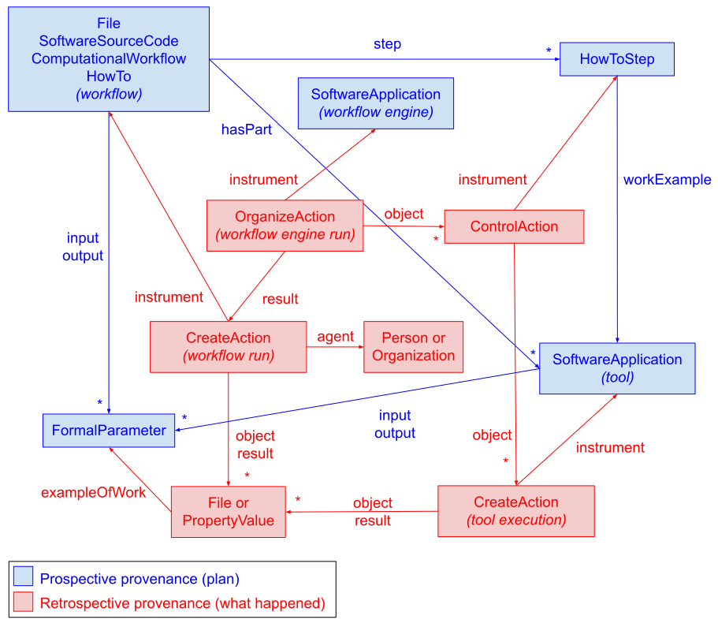
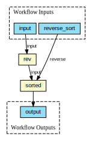

# Provenance Run Crate

* Version: 0.5-DRAFT
* Permalink: <https://w3id.org/ro/wfrun/provenance/0.5-DRAFT>
* Authors: Workflow Run RO-Crate working group

This profile uses terminology from the [RO-Crate 1.1 specification](https://w3id.org/ro/crate/1.1), and [extends it](https://www.researchobject.org/ro-crate/1.1/appendix/jsonld.html#extending-ro-crate) with additional terms from the [workflow-run](https://github.com/ResearchObject/ro-terms/tree/master/workflow-run) ro-terms namespace.


## Overview

This profile extends [Workflow Run Crate](workflow_run_crate) with specifications to describe internal details of the workflow run, such as step executions and intermediate outputs.

A Provenance Run Crate MUST record the details of *tool* executions orchestrated by the workflow through additional [CreateAction](http://schema.org/CreateAction) entities, each of which MUST refer to an entity representing the tool itself via [instrument](http://schema.org/instrument) as specified in [Process Run Crate](process_run_crate). Entities representing the tools MAY reference formal parameter definitions via `input` and `output` (and `environment`, in the case of [environment variables](workflow_run_crate#environment-variables-as-formal-parameters)) as specified in [Workflow Run Crate](workflow_run_crate). The workflow MUST refer to the orchestrated tools via [hasPart](http://schema.org/hasPart) (the usage of `hasPart` for this purpose follows the Bioschemas [ComputationalWorkflow profile](http://bioschemas.org/profiles/ComputationalWorkflow/1.0-RELEASE)).

The crate SHOULD also record *step* executions via [ControlAction](http://schema.org/ControlAction) instances, each of which MUST reference: a [HowToStep](http://schema.org/HowToStep) instance representing the step via `instrument`; the `CreateAction` representing the corresponding tool run via `object`. The workflow MUST reference any `HowToStep` instances that represent its steps via [step](http://schema.org/step). Each `HowToStep` instance MUST reference the entity that represents its corresponding tool via [workExample](http://schema.org/workExample), and MAY indicate its position in the execution order via [position](http://schema.org/position). In addition to `File`, `SoftwareSourceCode` and `ComputationalWorkflow`, a workflow that points to step metadata via `step` MUST have a type of [HowTo](http://schema.org/HowTo).

The crate MAY also include an [OrganizeAction](http://schema.org/OrganizeAction) representing the execution of the workflow *engine* (e.g. cwltool), which MUST point to: an entity representing the workflow engine (e.g. a [SoftwareApplication](http://schema.org/SoftwareApplication)) via `instrument`; the `CreateAction` that represents the workflow run via `result`; the `ControlAction` instances representing the step executions via `object`.

The tool that implements a step can in turn be a workflow (*nested workflow* or *subworkflow*): in this case, it MUST be represented as a `ComputationalWorkflow`, and all of the above directions apply to it recursively. If the subworkflow is described in a section of the main workflow (e.g. as in [packed CWL workflows](https://www.commonwl.org/v1.2/CommandLineTool.html#Packed_documents)), rather than in a file of its own, it SHOULD be added to the crate as a [contextual entity](https://www.researchobject.org/ro-crate/1.1/contextual-entities.html): in this case, its type list MUST NOT include `File`.

The following diagram shows the relationships between all provenance-related entities. Note the distinction between *prospective* provenance (plans for activities, e.g. a workflow) and *retrospective* provenance (what actually happened, e.g. the execution of a workflow).




## Example Metadata File (`ro-crate-metadata.json`)

```json
{ "@context": "https://w3id.org/ro/crate/1.1/context",
  "@graph": [
    {
        "@id": "ro-crate-metadata.json",
        "@type": "CreativeWork",
        "about": {"@id": "./"},
        "conformsTo": [
            {"@id": "https://w3id.org/ro/crate/1.1"},
            {"@id": "https://w3id.org/workflowhub/workflow-ro-crate/1.0"}
        ]
    },
    {
        "@id": "./",
        "@type": "Dataset",
        "conformsTo": [
            {"@id": "https://w3id.org/ro/wfrun/process/0.1"},
            {"@id": "https://w3id.org/ro/wfrun/workflow/0.1"},
            {"@id": "https://w3id.org/ro/wfrun/provenance/0.1"},
            {"@id": "https://w3id.org/workflowhub/workflow-ro-crate/1.0"}
        ],
        "hasPart": [
            {"@id": "packed.cwl"},
            {"@id": "327fc7aedf4f6b69a42a7c8b808dc5a7aff61376"},
            {"@id": "b9214658cc453331b62c2282b772a5c063dbd284"},
            {"@id": "97fe1b50b4582cebc7d853796ebd62e3e163aa3f"}
        ],
        "mainEntity": {"@id": "packed.cwl"},
        "mentions": [
            {"@id": "#4154dad3-00cc-4e35-bb8f-a2de5cd7dc49"}
        ]
    },
    {   "@id": "https://w3id.org/ro/wfrun/process/0.1",
        "@type": "CreativeWork",
        "name": "Process Run Crate",
        "version": "0.1"
    },
    {   "@id": "https://w3id.org/ro/wfrun/workflow/0.1",
        "@type": "CreativeWork",
        "name": "Workflow Run Crate",
        "version": "0.1"
    },
    {   "@id": "https://w3id.org/ro/wfrun/provenance/0.1",
        "@type": "CreativeWork",
        "name": "Provenance Run Crate",
        "version": "0.1"
    },
    {   "@id": "https://w3id.org/workflowhub/workflow-ro-crate/1.0",
        "@type": "CreativeWork",
        "name": "Workflow RO-Crate",
        "version": "1.0"
    },
    {
        "@id": "packed.cwl",
        "@type": ["File", "SoftwareSourceCode", "ComputationalWorkflow", "HowTo"],
        "hasPart": [
            {"@id": "packed.cwl#revtool.cwl"},
            {"@id": "packed.cwl#sorttool.cwl"}
        ],
        "input": [
            {"@id": "packed.cwl#main/input"},
            {"@id": "packed.cwl#main/reverse_sort"}
        ],
        "name": "packed.cwl",
        "output": [
            {"@id": "packed.cwl#main/output"}
        ],
        "programmingLanguage": {"@id": "https://w3id.org/workflowhub/workflow-ro-crate#cwl"},
        "step": [
            {"@id": "packed.cwl#main/rev"},
            {"@id": "packed.cwl#main/sorted"}
        ]
    },
    {
        "@id": "https://w3id.org/workflowhub/workflow-ro-crate#cwl",
        "@type": "ComputerLanguage",
        "alternateName": "CWL",
        "identifier": {"@id": "https://w3id.org/cwl/v1.0/"},
        "name": "Common Workflow Language",
        "url": {"@id": "https://www.commonwl.org/"},
        "version": "v1.0"
    },
    {
        "@id": "packed.cwl#main/input",
        "@type": "FormalParameter",
        "additionalType": "File",
        "defaultValue": "file:///home/stain/src/cwltool/tests/wf/hello.txt",
        "encodingFormat": "https://www.iana.org/assignments/media-types/text/plain",
        "name": "main/input"
    },
    {
        "@id": "packed.cwl#main/reverse_sort",
        "@type": "FormalParameter",
        "additionalType": "Boolean",
        "defaultValue": "True",
        "name": "main/reverse_sort"
    },
    {
        "@id": "packed.cwl#main/output",
        "@type": "FormalParameter",
        "additionalType": "File",
        "name": "main/output"
    },
    {
        "@id": "packed.cwl#main/rev",
        "@type": "HowToStep",
        "position": "0",
        "workExample": {"@id": "packed.cwl#revtool.cwl"}
    },
    {
        "@id": "packed.cwl#revtool.cwl",
        "@type": "SoftwareApplication",
        "description": "Reverse each line using the `rev` command",
        "input": [
            {"@id": "packed.cwl#revtool.cwl/input"}
        ],
        "name": "revtool.cwl",
        "output": [
            {"@id": "packed.cwl#revtool.cwl/output"}
        ]
    },
    {
        "@id": "packed.cwl#revtool.cwl/input",
        "@type": "FormalParameter",
        "additionalType": "File",
        "name": "revtool.cwl/input"
    },
    {
        "@id": "packed.cwl#revtool.cwl/output",
        "@type": "FormalParameter",
        "additionalType": "File",
        "name": "revtool.cwl/output"
    },
    {
        "@id": "packed.cwl#main/sorted",
        "@type": "HowToStep",
        "position": "1",
        "workExample": {"@id": "packed.cwl#sorttool.cwl"}
    },
    {
        "@id": "packed.cwl#sorttool.cwl",
        "@type": "SoftwareApplication",
        "description": "Sort lines using the `sort` command",
        "input": [
            {"@id": "packed.cwl#sorttool.cwl/reverse"},
            {"@id": "packed.cwl#sorttool.cwl/input"}
        ],
        "name": "sorttool.cwl",
        "output": [
            {"@id": "packed.cwl#sorttool.cwl/output"}
        ]
    },
    {
        "@id": "packed.cwl#sorttool.cwl/reverse",
        "@type": "FormalParameter",
        "additionalType": "Boolean",
        "name": "sorttool.cwl/reverse"
    },
    {
        "@id": "packed.cwl#sorttool.cwl/input",
        "@type": "FormalParameter",
        "additionalType": "File",
        "name": "sorttool.cwl/input"
    },
    {
        "@id": "packed.cwl#sorttool.cwl/output",
        "@type": "FormalParameter",
        "additionalType": "File",
        "name": "sorttool.cwl/output"
    },
    {
        "@id": "#a73fd902-8d14-48c9-835b-a5ba2f9149fd",
        "@type": "SoftwareApplication",
        "name": "cwltool 1.0.20181012180214"
    },
    {
        "@id": "#d6ab3175-88f5-4b6a-b028-1b13e6d1a158",
        "@type": "OrganizeAction",
        "agent": {"@id": "https://orcid.org/0000-0001-9842-9718"},
        "instrument": {"@id": "#a73fd902-8d14-48c9-835b-a5ba2f9149fd"},
        "name": "Run of cwltool 1.0.20181012180214",
        "object": [
            {"@id": "#4f7f887f-1b9b-4417-9beb-58618a125cc5"},
            {"@id": "#793b3df4-cbb7-4d17-94d4-0edb18566ed3"}
        ],
        "result": {"@id": "#4154dad3-00cc-4e35-bb8f-a2de5cd7dc49"},
        "startTime": "2018-10-25T15:46:35.210973"
    },
    {
        "@id": "https://orcid.org/0000-0001-9842-9718",
        "@type": "Person",
        "name": "Stian Soiland-Reyes"
    },
    {
        "@id": "#4154dad3-00cc-4e35-bb8f-a2de5cd7dc49",
        "@type": "CreateAction",
        "endTime": "2018-10-25T15:46:43.020168",
        "instrument": {"@id": "packed.cwl"},
        "name": "Run of workflow/packed.cwl#main",
        "object": [
            {"@id": "327fc7aedf4f6b69a42a7c8b808dc5a7aff61376"},
            {"@id": "#pv-main/reverse_sort"}
        ],
        "result": [
            {"@id": "b9214658cc453331b62c2282b772a5c063dbd284"}
        ],
        "startTime": "2018-10-25T15:46:35.211153"
    },
    {
        "@id": "327fc7aedf4f6b69a42a7c8b808dc5a7aff61376",
        "@type": "File",
        "exampleOfWork": [
            {"@id": "packed.cwl#main/input"},
            {"@id": "packed.cwl#revtool.cwl/input"}
        ]
    },
    {
        "@id": "#pv-main/reverse_sort",
        "@type": "PropertyValue",
        "exampleOfWork": {"@id": "packed.cwl#main/reverse_sort"},
        "name": "main/reverse_sort",
        "value": "True"
    },
    {
        "@id": "b9214658cc453331b62c2282b772a5c063dbd284",
        "@type": "File",
        "exampleOfWork": [
            {"@id": "packed.cwl#main/output"},
            {"@id": "packed.cwl#sorttool.cwl/output"}
        ]
    },
    {
        "@id": "#6933cce1-f8f0-4032-8848-e0fc9166e92f",
        "@type": "CreateAction",
        "endTime": "2018-10-25T15:46:36.967359",
        "instrument": {"@id": "packed.cwl#revtool.cwl"},
        "name": "Run of workflow/packed.cwl#main/rev",
        "object": [
            {"@id": "327fc7aedf4f6b69a42a7c8b808dc5a7aff61376"}
        ],
        "result": [
            {"@id": "97fe1b50b4582cebc7d853796ebd62e3e163aa3f"}
        ],
        "startTime": "2018-10-25T15:46:35.314101"
    },
    {
        "@id": "#4f7f887f-1b9b-4417-9beb-58618a125cc5",
        "@type": "ControlAction",
        "instrument": {"@id": "packed.cwl#main/rev"},
        "name": "orchestrate revtool.cwl",
        "object": {"@id": "#6933cce1-f8f0-4032-8848-e0fc9166e92f"}
    },
    {
        "@id": "97fe1b50b4582cebc7d853796ebd62e3e163aa3f",
        "@type": "File",
        "exampleOfWork": [
            {"@id": "packed.cwl#revtool.cwl/output"},
            {"@id": "packed.cwl#sorttool.cwl/input"}
        ]
    },
    {
        "@id": "#9eac64b2-c2c8-401f-9af8-7cfb0e998107",
        "@type": "CreateAction",
        "endTime": "2018-10-25T15:46:38.069110",
        "instrument": {"@id": "packed.cwl#sorttool.cwl"},
        "name": "Run of workflow/packed.cwl#main/sorted",
        "object": [
            {"@id": "97fe1b50b4582cebc7d853796ebd62e3e163aa3f"},
            {"@id": "#pv-main/sorted/reverse"}
        ],
        "result": [
            {"@id": "b9214658cc453331b62c2282b772a5c063dbd284"}
        ],
        "startTime": "2018-10-25T15:46:36.975235"
    },
    {
        "@id": "#793b3df4-cbb7-4d17-94d4-0edb18566ed3",
        "@type": "ControlAction",
        "instrument": {"@id": "packed.cwl#main/sorted"},
        "name": "orchestrate sorttool.cwl",
        "object": {"@id": "#9eac64b2-c2c8-401f-9af8-7cfb0e998107"}
    },
    {
        "@id": "#pv-main/sorted/reverse",
        "@type": "PropertyValue",
        "exampleOfWork": {"@id": "packed.cwl#sorttool.cwl/reverse"},
        "name": "main/sorted/reverse",
        "value": "True"
    }
]
}
```


## Representing parameter connections

In most workflows, the outputs of one or more steps are needed as input for subsequent steps: this creates a *connection* between the corresponding parameters of the tools that implement those steps. For instance, consider the "revsort" workflow represented in the above example:

<p align="center"></p>

In this workflow, the output of the `rev` step is used as input by the `sorted` step, creating a connection between the `output` parameter of `revtool.cwl` and the `input` parameter of `sorttool.cwl`. A connection can also occur between tool parameters and workflow parameters: looking again at the above example, the `reverse_sort` workflow parameter is connected to the `reverse` parameter of `sorttool.cwl`.

A provenance run crate MAY describe parameter connections using the `ParameterConnection` type from the [workflow-run](https://github.com/ResearchObject/ro-terms/tree/master/workflow-run) ro-terms namespace. References to the `ParameterConnection` instances SHOULD follow the CWL convention, where connections to workflow output parameters are referenced by the workflow while other connections are referenced by the receiving step:

```json
{
    "@id": "packed.cwl",
    "@type": ["File", "SoftwareSourceCode", "ComputationalWorkflow", "HowTo"],
    "connection": [
        {"@id": "#150ffba3-9dc2-4b14-8a6b-3f826f70e41b"}
    ],
    ...
},
{
    "@id": "#150ffba3-9dc2-4b14-8a6b-3f826f70e41b",
    "@type": "ParameterConnection",
    "sourceParameter": {"@id": "packed.cwl#sorttool.cwl/output"},
    "targetParameter": {"@id": "packed.cwl#main/output"}
},
{
    "@id": "packed.cwl#main/sorted",
    "@type": "HowToStep",
    "connection": [
        {"@id": "#548ab27a-3abf-4035-b3dd-f2989762d5c0"},
        {"@id": "#ed883346-fb32-43dd-b965-18aa5cac9350"}
    ],
    "workExample": {"@id": "packed.cwl#sorttool.cwl"}
},
{
    "@id": "#548ab27a-3abf-4035-b3dd-f2989762d5c0",
    "@type": "ParameterConnection",
    "sourceParameter": {"@id": "packed.cwl#revtool.cwl/output"},
    "targetParameter": {"@id": "packed.cwl#sorttool.cwl/input"}
},
{
    "@id": "#ed883346-fb32-43dd-b965-18aa5cac9350",
    "@type": "ParameterConnection",
    "sourceParameter": {"@id": "packed.cwl#main/reverse_sort"},
    "targetParameter": {"@id": "packed.cwl#sorttool.cwl/reverse"}
}
```

Note that the `workflow-run` terms are not part of the standard RO-Crate context, so they have to be added to the crate's `@context` to be used:

```json
{
    "@context": [
        "https://w3id.org/ro/crate/1.1/context",
        "https://w3id.org/ro/terms/workflow-run"
    ],
    "@graph": [...]
}
```


## Engine configuration files

A workflow engine may support configuration through a configuration file. In this case, the specific configuration file used in the engine run SHOULD be added to the `object` attribute of the corresponding `OrganizeAction`.

```json
{
    "@id": "#e55c4723-7814-4cef-b3b6-96c1dbf1ae9b",
    "@type": "SoftwareApplication",
    "name": "StreamFlow 0.2.0.dev2"
},
{
    "@id": "#7ff2f0b6-0294-4da5-9ecc-5846b8aa4e66",
    "@type": "OrganizeAction",
    "instrument": {"@id": "#e55c4723-7814-4cef-b3b6-96c1dbf1ae9b"},
    "name": "Run of StreamFlow 0.2.0.dev2",
    "object": [
        {"@id": "7ff2f0b6-0294-4da5-9ecc-5846b8aa4e66/streamflow.yml"},
        {"@id": "#a203c665-668d-4488-bf57-5b2eedf77905"},
        ...
    ],
    "result": {"@id": "#9984d778-7cd8-49ea-984d-7c58a0404f85"}
},
{
    "@id": "7ff2f0b6-0294-4da5-9ecc-5846b8aa4e66/streamflow.yml",
    "@type": "File",
    "name": "StreamFlow configuration file",
    "encodingFormat": "application/yaml"
},
{
    "@id": "#a203c665-668d-4488-bf57-5b2eedf77905",
    "@type": "ControlAction",
    "instrument": {"@id": "predictions.cwl#extract-tissue-low"},
    "object": {"@id": "#465dafb2-66cf-4af9-a6cf-b8fea0e8acc9"}
},
...
```

See also the [section on referencing configuration files of executed tools](process_run_crate#referencing-configuration-files).


## Tool wrapper dependencies

In some workflow systems (e.g., CWL, Galaxy), tools are typically wrappers for an executable written in a scripting programming language. This MAY be represented by listing the wrapped tool and its dependencies as described in [Specifying software dependencies](process_run_crate#specifying-software-dependencies). The wrapped tool can be highlighted by using `mainEntity`:

```json
{
    "@id": "data_analysis_tool.cwl",
    "@type": "SoftwareApplication",
    "softwareRequirements": [
        {"@id": "scripts/data_analysis_script.py"},
        {"@id": "https://pypi.org/project/numpy/1.26.2/"}
    ],
    "mainEntity": {"@id": "scripts/data_analysis_script.py"}
},
{
    "@id": "scripts/data_analysis_script.py",
    "@type": "SoftwareApplication",
    "version": "0.1"
},
{
    "@id": "https://pypi.org/project/numpy/1.26.2/",
    "@type": "SoftwareApplication",
    "name": "NumPy",
    "version": "1.26.2"
}
```


## Conditional step execution

Some workflow languages provide a mechanism to execute a step only when some condition is verified. An example of this is the [when](https://www.commonwl.org/v1.2/Workflow.html#Conditional_execution_(Optional)) clause in CWL. If an execution of a step is skipped in this way, the corresponding action SHOULD NOT be included in the RO-Crate metadata, while the step itself and the tool it executes MAY be represented.


## Requirements

The requirements of this profile are those of [Workflow Run Crate](workflow_run_crate) plus the ones listed below.

<table>

  <tr>
   <td><strong>Property</strong></td>
   <td><strong>Required?</strong></td>
   <td><strong>Description</strong></td>
  </tr>

  <tr>
   <th colspan="3"><strong>Dataset</strong> (the <a href="https://www.researchobject.org/ro-crate/1.1/root-data-entity.html">root data entity</a>, e.g. <code>"@id": "./"</code>)</th>
  </tr>
  <tr>
   <td>conformsTo</td>
   <td>MUST</td>
   <td>Array MUST reference a <code>CreativeWork</code> entity with an <code>@id</code> URI that is consistent with the versioned <em>Permalink</em> of this document, and SHOULD also reference versioned permalinks for <a href="https://w3id.org/ro/wfrun/process/0.1">Process Run Crate</a>, <a href="https://w3id.org/ro/wfrun/workflow/0.1">Workflow Run Crate</a> and <a href="https://w3id.org/workflowhub/workflow-ro-crate/1.0">Workflow RO-Crate</a>.</td>
  </tr>

  <tr>
   <th colspan="3"><strong>ComputationalWorkflow</strong></th>
  </tr>

  <tr>
   <td>@type</td>
   <td>MUST</td>
   <td>MUST include <code>File</code>, <code>SoftwareSourceCode</code> and <code>ComputationalWorkflow</code>. If the <code>step</code> property is used, MUST also include <code>HowTo</code>. In the case of a subworkflow added to the crate as a contextual entity, MUST NOT include <code>File</code>.</td>
  </tr>

  <tr>
   <td>hasPart</td>
   <td>MUST</td>
   <td>Identifiers of the <em>tools</em> (including subworkflows) orchestrated by this workflow, represented as specified in the <a href="process_run_crate#requirements">Process Run Crate requirements</a> under "SoftwareApplication". The referenced tools MAY also incude formal parameter definitions via <code>input</code> and <code>output</code> as specified in <a href="workflow_run_crate">Workflow Run Crate</a>. In the case of subworkflows, the type MUST include <code>ComputationalWorkflow</code></td>
  </tr>

  <tr>
   <td>step</td>
   <td>SHOULD</td>
   <td>Identifiers of the <code>HowToStep</code> instances representing this workflow's steps. If this property is used, the workflow MUST include <code>HowTo</code> among its types.</td>
  </tr>

  <tr>
   <th colspan="3"><strong>HowToStep</strong></th>
  </tr>

  <tr>
   <td>workExample</td>
   <td>MUST</td>
   <td>Identifier of the tool (or subworkflow) that implements this step.</td>
  </tr>

  <tr>
   <td>position</td>
   <td>MAY</td>
   <td>An integer indicating the step's position in the execution order. In general, there may be more than one valid execution order for a workflow. For instance, if step C needs outputs from steps A and B, but A and B don't need each other's output, both A-B-C and B-A-C are valid execution orders (A and B might even be executed in parallel). For this reason, the only requirement is that for each step pair (S1, S2), if S2 needs outputs from S1, S2's <code>position</code> MUST be greater than S1's.</td>
  </tr>

  <tr>
   <th colspan="3"><strong>ControlAction</strong></th>
  </tr>

  <tr>
   <td>instrument</td>
   <td>MUST</td>
   <td>Identifier of the <code>HowToStep</code> whose execution is represented by this action.</td>
  </tr>

  <tr>
   <td>object</td>
   <td>MUST</td>
   <td>Identifier(s) of the <code>CreateAction</code> describing the <em>tool</em> execution(s) corresponding to this <em>step</em> execution.</td>
  </tr>

  <tr>
   <td>actionStatus</td>
   <td>MAY</td>
   <td>SHOULD be <a href="https://schema.org/CompletedActionStatus">CompletedActionStatus</a> if the step completed successfully or <a href="https://schema.org/FailedActionStatus">FailedActionStatus</a> if it failed to complete. In the latter case, consumers should be prepared for the absence of any dependent actions (i.e., <code>CreateAction</code> instances corresponding to tool executions; the opposite is not necessarily true: a step can be successful even if some of its associated tool executions failed, e.g. in fault tolerant engines). If this attribute is not specified, consumers should assume that the step completed successfully.</td>

  <tr>
   <td>error</td>
   <td>MAY</td>
   <td>Additional information on the cause of the failure, if available. SHOULD NOT be specified unless <code>actionStatus</code> is set to <code>FailedActionStatus</code>.</td>
  </tr>

  </tr>

  <tr>
   <th colspan="3"><strong>OrganizeAction</strong></th>
  </tr>

  <tr>
   <td>instrument</td>
   <td>MUST</td>
   <td>Identifier of the entity (e.g. a <code>SoftwareApplication</code>) that represents the <em>workflow engine</em> (e.g. cwltool).</td>
  </tr>

  <tr>
   <td>object</td>
   <td>MUST</td>
   <td>Identifiers of the <code>ControlAction</code> instances representing the step executions.</td>
  </tr>

  <tr>
   <td>result</td>
   <td>MUST</td>
   <td>Identifier of the <code>CreateAction</code> representing the workflow execution.</td>
  </tr>

  <tr>
   <td>actionStatus</td>
   <td>MAY</td>
   <td>SHOULD be <a href="https://schema.org/CompletedActionStatus">CompletedActionStatus</a> if the engine execution was successful or <a href="https://schema.org/FailedActionStatus">FailedActionStatus</a> if it failed. In the latter case, consumers should be prepared for the absence of any dependent actions (i.e., <code>CreateAction</code> instances corresponding to workflow and tool executions, <code>ControlAction</code> instances corresponding to step executions). If this attribute is not specified, consumers should assume that the execution was successful.</td>

  <tr>
   <td>error</td>
   <td>MAY</td>
   <td>Additional information on the cause of the failure, if available. SHOULD NOT be specified unless <code>actionStatus</code> is set to <code>FailedActionStatus</code>.</td>
  </tr>

</table>
