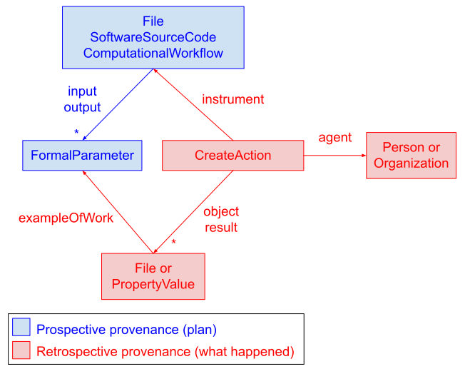

# Workflow Run Crate

* Version: 0.6-DRAFT
* Permalink: <https://w3id.org/ro/wfrun/workflow/0.6-DRAFT>
* Authors: [Workflow Run RO-Crate working group](https://www.researchobject.org/workflow-run-crate/#community)
* License: [Apache License, version 2.0](https://www.apache.org/licenses/LICENSE-2.0) (SPDX: [`Apache-2.0`](http://spdx.org/licenses/Apache-2.0))
* Example conforming crate: [ro-crate-metadata.json](example2/ro-crate-metadata.json) [ro-crate-preview.html](example2/ro-crate-preview.html)
* Profile Crate: [ro-crate-metadata.json](ro-crate-metadata.json) [ro-crate-preview.html](ro-crate-preview.html)
* Extends:
  - [Process Run Crate](https://w3id.org/ro/wfrun/process/0.6-DRAFT)
  - [Workflow RO-Crate](https://w3id.org/workflowhub/workflow-ro-crate/) (compatible with version 1.0 and later minor versions)
* JSON-LD context: <https://w3id.org/ro/terms/workflow-run/context>
* Vocabulary terms:  <https://w3id.org/ro/terms/workflow-run#>

This profile uses terminology from the [RO-Crate 1.2 specification](https://w3id.org/ro/crate/1.2).


## Overview

This profile is used to describe the execution of a computational tool that has orchestrated the execution of other tools. Such a tool is represented as a [workflow](https://www.researchobject.org/ro-crate/specification/1.2/workflows.html) that can be executed using a *Workflow Management System (WMS)*, or *workflow engine* (e.g. [cwltool](https://github.com/common-workflow-language/cwltool)).

Workflow Run Crate is a combination of [Process Run Crate](../process_run_crate) and [Workflow RO-Crate](https://w3id.org/workflowhub/workflow-ro-crate/). In particular, the RO-Crate MUST have a `ComputationalWorkflow` [mainEntity](http://schema.org/mainEntity) described according to the Workflow RO-Crate specification (*main workflow*), and `CreateAction` instances corresponding to its execution (thus having the main workflow as `instrument`) MUST be described as specified in Process Run Crate and this profile. Details regarding the execution of individual workflow steps can be described with the [Provenance Run Crate](../provenance_run_crate) profile.

Workflows can have multiple input and output parameter slots that have to be mapped to actual files, directories or other values (e.g., a string or a number) before they can be executed. It is OPTIONAL to define such entities for a `ComputationalWorkflow`. If included, parameter definitions MUST be provided as [FormalParameter](https://bioschemas.org/types/FormalParameter/1.0-RELEASE) entities and referenced from the `ComputationalWorkflow` via `input` and `output` (see the [Bioschemas ComputationalWorkflow profile](https://bioschemas.org/profiles/ComputationalWorkflow/1.0-RELEASE)).

A data entity or `PropertyValue` that realizes a `FormalParameter` definition SHOULD refer to it via [exampleOfWork](https://schema.org/exampleOfWork); additionally, if the data entity or `PropertyValue` is an illustrative example of the parameter, the latter MAY refer back to the former using the reverse property [workExample](https://schema.org/workExample). This links the `input` of a `ComputationalWorkflow` to the `object` of a `CreateAction`, and the `output` of a `ComputationalWorkflow` to the `result` of a `CreateAction`. An `object` item that does not match a slot in the workflow's input interface (e.g., a [configuration file](../process_run_crate#referencing-configuration-files) read from a predefined path) MUST NOT refer to a `FormalParameter` of the `ComputationalWorkflow` via `exampleOfWork`. A `FormalParameter` that maps to a `PropertyValue` SHOULD have a subclass of [DataType](https://schema.org/DataType) (e.g., [Integer](https://schema.org/Integer)) &mdash; or [PropertyValue](https://schema.org/PropertyValue), in the case of dictionary-like structured types &mdash; as its `additionalType`. See [CWL parameter mapping](/workflow-run-crate/cwl_param_mapping) for an example. To support reproducibility, the `name` field of a `FormalParameter` instance SHOULD match the name of the corresponding workflow parameter slot.

Additional properties described in the [Bioschemas FormalParameter profile](https://bioschemas.org/profiles/FormalParameter/1.0-RELEASE) (e.g., `defaultValue`) MAY be used to provide additional information, but strict conformance is not required. A `FormalParameter` definition that strictly conforms to the Bioschemas profile SHOULD reference the relevant versioned URL via `conformsTo`.

The following diagram shows the relationships between provenance-related entities. Note the distinction between *prospective* provenance (plans for activities, e.g. a workflow) and *retrospective* provenance (what actually happened, e.g. the execution of a workflow).




## Example Metadata File (`ro-crate-metadata.json`)

* [ro-crate-metadata.json](example2/ro-crate-metadata.json)
* [ro-crate-preview.html](example2/ro-crate-preview.html)

<!-- Remember to update above as well as below! -->

```json
{ "@context": [
    "https://w3id.org/ro/crate/1.2/context",
    "https://w3id.org/ro/terms/workflow-run/context"
  ],
  "@graph": [
    {
        "@id": "ro-crate-metadata.json",
        "@type": "CreativeWork",
        "about": {"@id": "./"},
        "conformsTo": {"@id": "https://w3id.org/ro/crate/1.2"}
    },
    {
        "@id": "./",
        "@type": "Dataset",
        "conformsTo": [
            {"@id": "https://w3id.org/ro/wfrun/process/0.6-DRAFT"},
            {"@id": "https://w3id.org/ro/wfrun/workflow/0.6-DRAFT"},
            {"@id": "https://w3id.org/workflowhub/workflow-ro-crate/1.1"}
        ],
        "hasPart": [
            {"@id": "Galaxy-Workflow-Hello_World.ga"},
            {"@id": "inputs/abcdef.txt"},
            {"@id": "outputs/Select_first_on_data_1_2.txt"},
            {"@id": "outputs/tac_on_data_360_1.txt"}
        ],
        "license": {"@id": "http://spdx.org/licenses/CC0-1.0"},
        "mainEntity": {"@id": "Galaxy-Workflow-Hello_World.ga"},
        "mentions": {"@id": "#wfrun-5a5970ab-4375-444d-9a87-a764a66e3a47"}
    },
    {   "@id": "https://w3id.org/ro/wfrun/process/0.6-DRAFT",
        "@type": "CreativeWork",
        "name": "Process Run Crate",
        "version": "0.6-DRAFT"
    },
    {   "@id": "https://w3id.org/ro/wfrun/workflow/0.6-DRAFT",
        "@type": "CreativeWork",
        "name": "Workflow Run Crate",
        "version": "0.6-DRAFT"
    },
    {   "@id": "https://w3id.org/workflowhub/workflow-ro-crate/1.1",
        "@type": "CreativeWork",
        "name": "Workflow RO-Crate",
        "version": "1.1"
    },
    {
        "@id": "Galaxy-Workflow-Hello_World.ga",
        "@type": ["File", "SoftwareSourceCode", "ComputationalWorkflow"],
        "name": "Hello World (Galaxy Workflow)",
        "author": {"@id": "https://orcid.org/0000-0001-9842-9718"},
        "creator": {"@id": "https://orcid.org/0000-0001-9842-9718"},
        "programmingLanguage": {"@id": "https://w3id.org/workflowhub/workflow-ro-crate#galaxy"},
        "input": [
            {"@id": "#simple_input"},
            {"@id": "#verbose-param"}
        ],
        "output": [
            {"@id": "#reversed"},
            {"@id": "#last_lines"}
        ]
    },
    {
        "@id": "#simple_input",
        "@type": "FormalParameter",
        "additionalType": "File",
        "conformsTo": {"@id": "https://bioschemas.org/profiles/FormalParameter/1.0-RELEASE"},
        "description": "A simple set of lines in a text file",
        "encodingFormat": [
            "text/plain",
            {"@id": "http://edamontology.org/format_2330"}
        ],
        "workExample": {"@id": "inputs/abcdef.txt"},
        "name": "simple_input",
        "valueRequired": "True"
    },
    {
        "@id": "#verbose-param",
        "@type": "FormalParameter",
        "additionalType": "Boolean",
        "conformsTo": {"@id": "https://bioschemas.org/profiles/FormalParameter/1.0-RELEASE"},
        "description": "Increase logging output",
        "workExample": {"@id": "#verbose-pv"},
        "name": "verbose",
        "valueRequired": "False"
    },
    {
        "@id": "#reversed",
        "@type": "FormalParameter",
        "additionalType": "File",
        "conformsTo": {"@id": "https://bioschemas.org/profiles/FormalParameter/1.0-RELEASE"},
        "description": "All the lines, reversed",
        "encodingFormat": [
            "text/plain",
            {"@id": "http://edamontology.org/format_2330"}
        ],
        "name": "reversed",
        "workExample": {"@id": "outputs/tac_on_data_360_1.txt"}
    },
    {
        "@id": "#last_lines",
        "@type": "FormalParameter",
        "additionalType": "File",
        "conformsTo": {"@id": "https://bioschemas.org/profiles/FormalParameter/1.0-RELEASE"},
        "description": "The last lines of workflow input are the first lines of the reversed input",
        "encodingFormat": [
            "text/plain",
            {"@id": "http://edamontology.org/format_2330"}
        ],
        "name": "last_lines",
        "workExample": {"@id": "outputs/Select_first_on_data_1_2.txt"}
    },
    {
        "@id": "https://orcid.org/0000-0001-9842-9718",
        "@type": "Person",
        "name": "Stian Soiland-Reyes"
    },
    {
        "@id": "https://w3id.org/workflowhub/workflow-ro-crate#galaxy",
        "@type": "ComputerLanguage",
        "identifier": "https://galaxyproject.org/",
        "name": "Galaxy",
        "url": "https://galaxyproject.org/"
    },
    {
        "@id": "#wfrun-5a5970ab-4375-444d-9a87-a764a66e3a47",
        "@type": "CreateAction",
        "name": "Galaxy workflow run 5a5970ab-4375-444d-9a87-a764a66e3a47",
        "endTime": "2018-09-19T17:01:07+10:00",
        "instrument": {"@id": "Galaxy-Workflow-Hello_World.ga"},
        "subjectOf": {"@id": "https://usegalaxy.eu/u/5dbf7f05329e49c98b31243b5f35045c/p/invocation-report-a3a1d27edb703e5c"},
        "object": [
            {"@id": "inputs/abcdef.txt"},
            {"@id": "#verbose-pv"}
        ],
        "result": [
            {"@id": "outputs/Select_first_on_data_1_2.txt"},
            {"@id": "outputs/tac_on_data_360_1.txt"}
        ]
    },
    {
        "@id": "inputs/abcdef.txt",
        "@type": "File",
        "description": "Example input, a simple text file",
        "encodingFormat": "text/plain",
        "exampleOfWork": {"@id": "#simple_input"}
    },
    {
        "@id": "#verbose-pv",
        "@type": "PropertyValue",
        "exampleOfWork": {"@id": "#verbose-param"},
        "name": "verbose",
        "value": "True"
    },
    {
        "@id": "outputs/Select_first_on_data_1_2.txt",
        "@type": "File",
        "name": "Select_first_on_data_1_2 (output)",
        "description": "Example output of the last (aka first of reversed) lines",
        "encodingFormat": "text/plain",
        "exampleOfWork": {"@id": "#last_lines"}
    },
    {
        "@id": "outputs/tac_on_data_360_1.txt",
        "@type": "File",
        "name": "tac_on_data_360_1 (output)",
        "description": "Example output of the reversed lines",
        "encodingFormat": "text/plain",
        "exampleOfWork": {"@id": "#reversed"}
    },
    {
        "@id": "https://usegalaxy.eu/u/5dbf7f05329e49c98b31243b5f35045c/p/invocation-report-a3a1d27edb703e5c",
        "@type": "CreativeWork",
        "encodingFormat": "text/html",
        "datePublished": "2021-11-18T02:02:00Z",
        "name": "Workflow Execution Summary of Hello World"
    }
]
}
```


## Adding engine-specific traces

Some engines are able to generate contextual information about workflow runs in the form of logs, reports, etc. These are not workflow outputs, but rather additional files automatically generated by the engine, either by default or when activated via a configuration parameter or command line flag. It is RECOMMENDED to add any such files to the RO-Crate; the corresponding entities SHOULD refer to the relevant `Action` instance via [about](http://schema.org/about):

```json
{
    "@id": "#action-1",
    "@type": "CreateAction",
    ...
},
{
    "@id": "trace-20230120-40360336.txt",
    "@type": "File",
    "name": "Nextflow trace for action-1",
    "conformsTo": "https://www.nextflow.io/docs/latest/tracing.html#trace-report",
    "encodingFormat": "text/tab-separated-values",
    "about": "#action-1"
},
{
    "@id": "https://www.nextflow.io/docs/latest/tracing.html#trace-report",
    "@type": "CreativeWork",
    "name": "Nextflow trace report CSV profile"
}
```


## Environment variables as formal parameters

The Process Run Crate profile specifies how to [represent environment variable settings](../process_run_crate#representing-environment-variable-settings) that affected the execution of a particular action via `environment`. A workflow, in turn, MAY indicate that it is affected by a certain environment variable by using the same `environment` property and having it point to a `FormalParameter` whose `name` is equal to the variable's name. If an action corresponding to an execution of the workflow sets that variable, the `PropertyValue` SHOULD point to the `FormalParameter` via `exampleOfWork`:

```json
{
    "@id": "run_blast.cwl",
    "@type": ["File", "SoftwareSourceCode", "ComputationalWorkflow"],
    ...
    "environment": [
        {"@id": "run_blast.cwl#batch_size"}
    ]
},
{
    "@id": "run_blast.cwl#batch_size",
    "@type": "FormalParameter",
    "additionalType": "Integer",
    "name": "BATCH_SIZE",
},
{
    "@id": "#cb04c897-eb92-4c53-8a38-bcc1a16fd650",
    "@type": "CreateAction",
    "instrument": {"@id": "run_blast.cwl"},
    ...
    "environment": [
        {"@id": "#batch_size-pv"}
    ]
},
{
    "@id": "#batch_size-pv",
    "@type": "PropertyValue",
    "exampleOfWork": {"@id": "run_blast.cwl#batch_size"},
    "name": "BATCH_SIZE",
    "value": "100"
}
```


## Requirements

This profile inherits the requirements of [Process Run Crate](../process_run_crate) and [Workflow RO-Crate](https://w3id.org/workflowhub/workflow-ro-crate/). Additional specifications are listed below.

<table>

  <tr>
   <td><strong>Property</strong></td>
   <td><strong>Required?</strong></td>
   <td><strong>Description</strong></td>
  </tr>

  <tr>
   <th colspan="3"><strong>Dataset</strong> (the <a href="https://www.researchobject.org/ro-crate/1.2/root-data-entity.html">root data entity</a>, e.g. <code>"@id": "./"</code>)</th>
  </tr>
  <tr>
   <td>conformsTo</td>
   <td>MUST</td>
   <td>Array MUST reference a <code>CreativeWork</code> entity with an <code>@id</code> URI that is consistent with the versioned <em>Permalink</em> of this document, and SHOULD also reference versioned permalinks for <a href="https://w3id.org/ro/wfrun/process/0.6-DRAFT">Process Run Crate</a> and <a href="https://w3id.org/workflowhub/workflow-ro-crate/1.1">Workflow RO-Crate</a>.</td>
  </tr>

  <tr>
   <th colspan="3"><strong>PropertyValue</strong> or data entity that realizes a FormalParameter</th>
  </tr>

  <tr>
   <td>exampleOfWork</td>
   <td>SHOULD</td>
   <td>Identifier of the <code>FormalParameter</code> instance realized by this entity.</td>
  </tr>

  <tr>
   <th colspan="3"><strong>FormalParameter</strong></th>
  </tr>

  <tr>
   <td>name</td>
   <td>SHOULD</td>
   <td>SHOULD match the name of the corresponding workflow parameter slot, e.g. <code>n_lines</code></td>
  </tr>

  <tr>
   <td>description</td>
   <td>MAY</td>
   <td>A description of the parameter's purpose, e.g. <code>Number of lines</code></td>
  </tr>

  <tr>
   <td>workExample</td>
   <td>MAY</td>
   <td>Identifier of the data entity or <code>PropertyValue</code> instance that realizes this parameter. The data entity or <code>PropertyValue</code> instance SHOULD refer to this parameter via <a href="http://schema.org/exampleOfWork">exampleOfWork</a>.</td>
  </tr>

  <tr>
   <td>additionalType</td>
   <td>MUST</td>
   <td>SHOULD include: <code>File</code>, <code>Dataset</code> or <code>Collection</code> if it maps to a file, directory or <a href="../process_run_crate#representing-multi-file-objects">multi-file dataset</a>, respectively; <code>PropertyValue</code> if it maps to a dictionary-like structured value (e.g. a CWL <em>record</em>); <a href="http://schema.org/DataType">DataType</a> or one of its subtypes (e.g. <a href="http://schema.org/Integer">Integer</a>) if it maps to a non-structured value.</td>
  </tr>

</table>

For each entity described in the table, the most important properties are highlighted. Other properties supported by the entity (e.g. [minValue](http://schema.org/minValue) for a [PropertyValue](http://schema.org/PropertyValue)) can also be used (they are an implicit MAY requirement). See also [Extending RO-Crate](https://www.researchobject.org/ro-crate/specification/1.2/appendix/jsonld.html#extending-ro-crate) for guidance on defining and using terms not included in the RO-Crate context.
